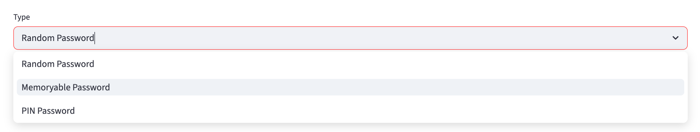
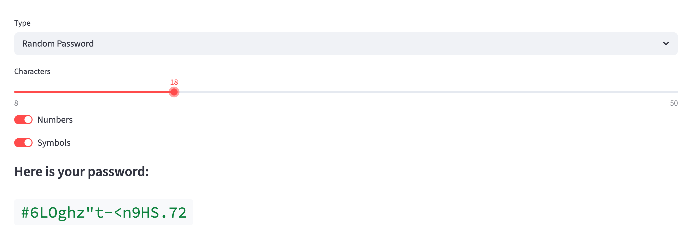
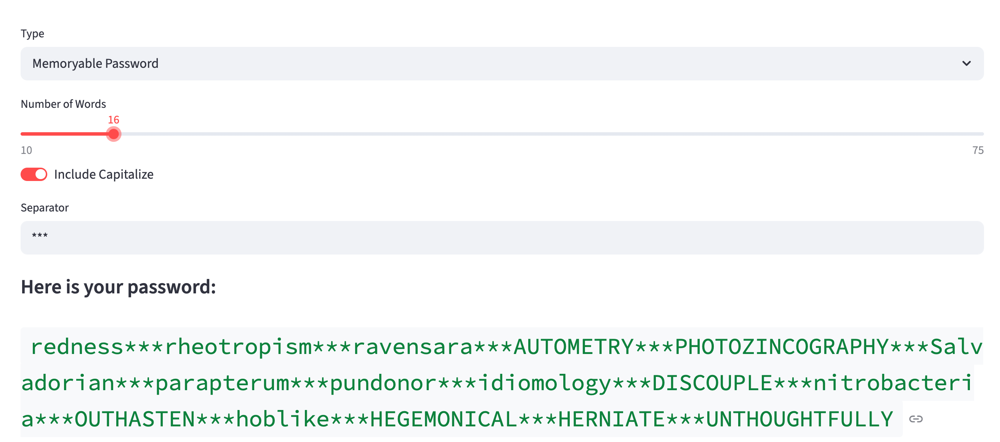
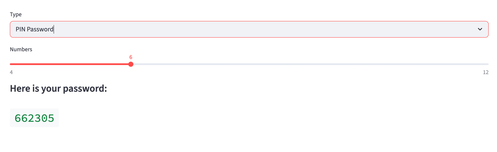

# 🔑 Password Generator

A beginner-friendly Python project that generates three types of passwords, with both a CLI and an interactive **Streamlit** web interface.

## Features

- **Random Password** — customizable length, optional digits and symbols
- **Memorable Password** — a sequence of random English words joined by a separator, with optional capitalization
- **PIN Code** — a short numeric PIN of configurable length

All generators use Python's `secrets` module, which is cryptographically secure.

---

## Directory Structure

```
Password_generator/
├── src/
│   ├── password_generator.py
│   └── app.py                  # Streamlit web interface
├── requirements.txt
└── README.md
```

---

## How It Works

The project is built with **OOP** and follows a simple inheritance pattern:

1. `PasswordGenerator` — abstract base class with an abstract `generate()` method
2. `RandomPassword` — inherits from base, generates ASCII-based passwords
3. `MemoryablePassword` — inherits from base, generates word-based passwords using NLTK
4. `PinPassword` — inherits from base, generates numeric PIN codes

Each subclass overrides the `generate()` method with its own logic.

---

## Requirements

Install dependencies with:

```bash
pip install -r requirements.txt
```

`requirements.txt`:

```
streamlit
nltk
```

> **Note:** On first run, NLTK will automatically download the `words` corpus. An internet connection is required for this step.

---

## How to Run

### CLI

```bash
python src/password_generator.py
```

Sample output:

```
Testing RandomPassword...
Here is your password: aB3$kT!mZq@#wL9^
Testing MemoryablePassword...
Here is your password: harbor-SIGNAL-point-BREEZE-lamp-...
Testing PinPassword...
Here is your password: 482916
Done
```

### Streamlit Web App

```bash
streamlit run src/app.py
```

Then open your browser at `http://localhost:8501`.

---

## ScreenShots

#### Choices



---

#### Random Password



---

#### Memoryable Password



---

#### PIN Code



## Usage Examples

```python
from password_generator import RandomPassword, MemoryablePassword, PinPassword

# 16-character password with digits and symbols
rp = RandomPassword(length=16, include_digits=True, include_symbols=True)
print(rp.generate())

# 5 words separated by underscores, mixed capitalization
mp = MemoryablePassword(number_of_words=5, separator="_", capitalization=True)
print(mp.generate())

# 6-digit PIN
pin = PinPassword(length=6)
print(pin.generate())
```
