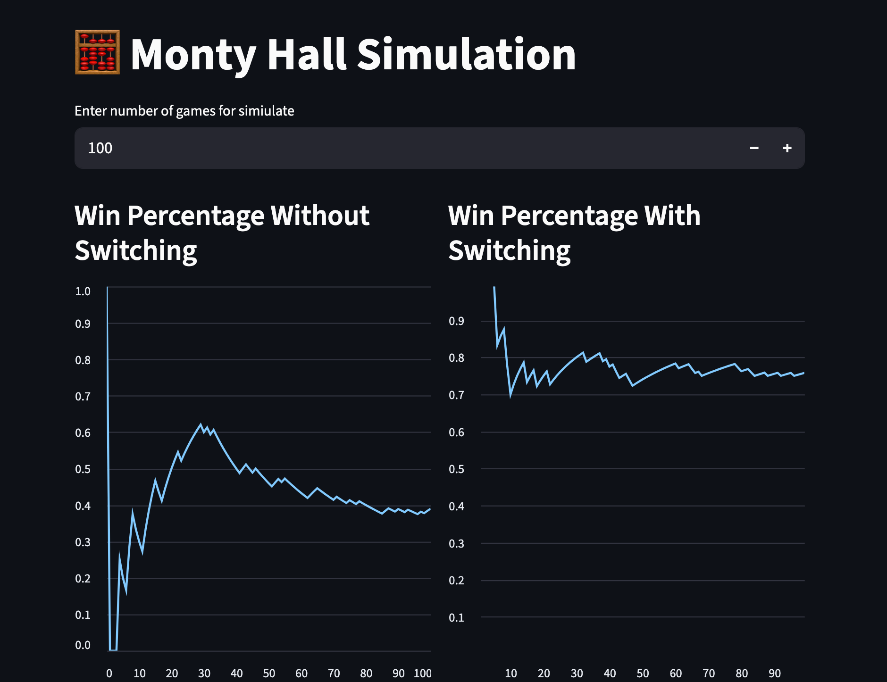

# Monty Hall Simulation


An interactive simulation of the **Monty Hall Problem** built with Python and Streamlit, showing in real time how switching doors affects your odds of winning.

## What is the Monty Hall Problem?

The Monty Hall Problem is a famous probability puzzle based on a game show scenario:

1. You are shown **3 doors**. Behind one is a prize; behind the other two are goats.
2. You pick a door.
3. The host (who knows what's behind each door) opens **one of the remaining doors** to reveal a goat.
4. You are given a choice: **stick with your original door or switch** to the other unopened one.

Counterintuitively, **switching wins ~66% of the time**, while staying wins only ~33%.

This simulation runs the game thousands of times to demonstrate that result visually.

## Features

- Configurable number of simulation runs (1 to 1,000,000)
- Live-updating line charts for both strategies side by side
- Win percentages converge toward the theoretical values as games increase

## Project Structure

```
monty-hall/
├── monty_hall.py      # Core simulation logic
└── app.py             # Streamlit frontend
```

## Getting Started

### Prerequisites

- Python 3.x
- Streamlit

### Installation

open the Monty Hall Problem dir in your terminal
then run this command

```bash
pip install -r requirements.txt
```

### Running the App

```bash
streamlit run app.py
```

Then open your browser to `http://localhost:8501`.

## Usage

1. Enter the number of games to simulate using the number input.
2. Watch the two line charts update in real time as each game is played.
3. The left chart tracks the win rate for **staying**; the right for **switching**.
4. As the number of games grows, both lines converge toward their theoretical values (~33% and ~66%).

## How It Works

### `monty_hall.py`

| Function | Description |
|---|---|
| `monty_hall_problem(switch_doors, range_of_game)` | Runs the game `range_of_game` times and returns the total wins |
| `main(number)` | Runs both strategies and returns win rates as a `(stay, switch)` tuple |

The simulation randomises both the prize placement and the player's initial pick each round, then has Monty open a valid goat door before applying the chosen strategy.

### `app.py`

Calls `main(1)` once per game iteration inside a loop, accumulating results and streaming each data point into Streamlit's live `line_chart`.

## Example Output

```
Winning without switching percentage per 1000 times: 33.70%
Winning with switching percentage per 1000 times: 66.80%
```

## ScreenShot



## Notes

- `main()` raises a `ValueError` if called with `0` games.
- The typo `probibality` in the `main()` docstring and `Winnig` in the print statements are present in the original source.

## Further Reading

- [Monty Hall Problem — Wikipedia](https://en.wikipedia.org/wiki/Monty_Hall_problem)
- [Streamlit Documentation](https://docs.streamlit.io)
